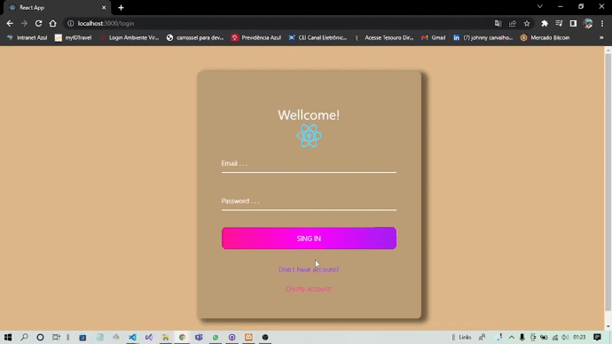

<h1 align="center">Login-and-Register_Page</h1>
Login and register page with React JS in the Front End and Node JS in the Back End, too i will using the database MySql with program Xampp. 

# <h2> Technologies used </h2>

 
  

  

# <h1 align="center"> The project .Gif </h1>

    

